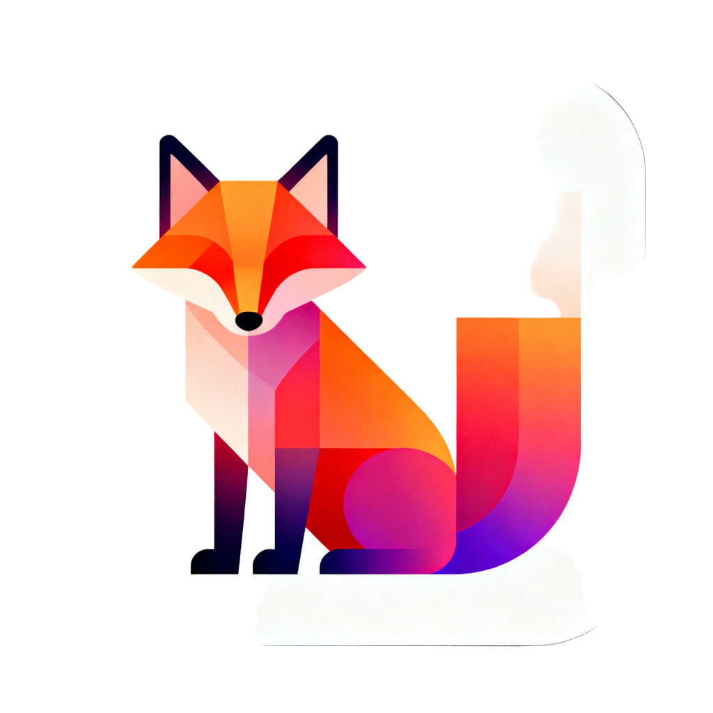
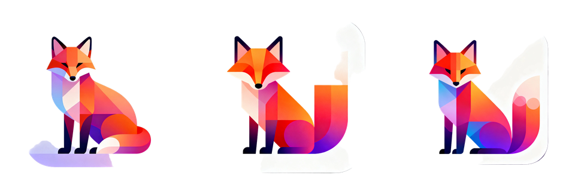
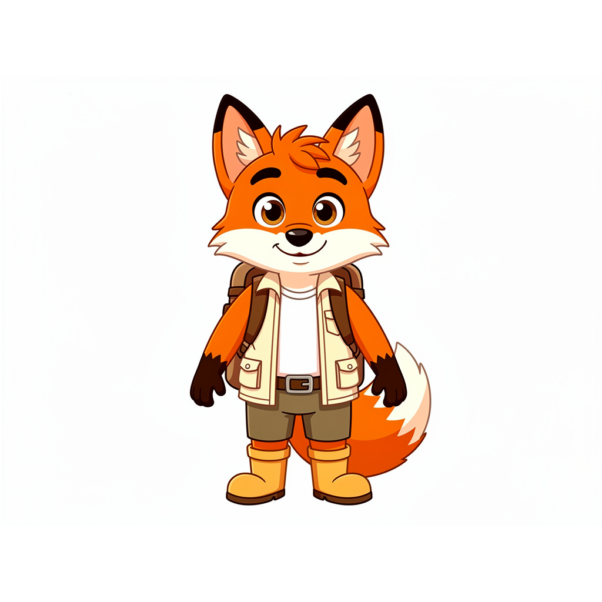
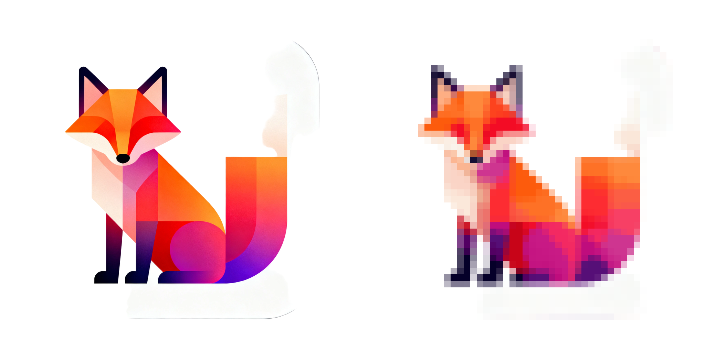

# icon-creator-skills

[](https://www.python.org/)
[](LICENSE)
[](CHANGELOG.md)

Open-source agent skills toolkit for **icon and mascot generation** with multi-platform asset packaging. Built on OpenRouter image models, designed to drop into Claude Code, OpenCode, and any agent harness that supports the skill format.

> Status: **v1.0.0 release candidate**. All planned phases are implemented in the repo. Publishing to PyPI / marketplace directories is intentionally manual.

---

## Example outputs

These are real outputs from this repo's local `output/` runs, committed as small README examples.

### Icon prompt

Prompt:

```text
geometric fox app icon
```

Command:

```bash
python skills/icon-creator/scripts/generate.py \
  --description "geometric fox app icon" \
  --style-preset gradient \
  --variants 3 \
  --seed 42
```

Output:



Variant preview:



Result files:

- `master.png`
- `preview.png`
- `variants/1.png`, `variants/2.png`, `variants/3.png`
- `metadata.json`
- `prompt-debug.txt`

### Mascot prompt

Prompt:

```text
friendly fox explorer mascot
```

Command:

```bash
python skills/mascot-creator/scripts/generate.py \
  --description "friendly fox explorer mascot" \
  --type stylized \
  --preset cartoon-2d \
  --personality "curious and helpful" \
  --variants 1 \
  --best-of-n 1
```

Output:



Result files:

- `master.png`
- `variants/1.png`
- `style-guide.md`
- `metadata.json`

### PNG to SVG example

Command:

```bash
python skills/png-to-svg/scripts/vectorize.py \
  --input output/geometric-fox-app-icon-20260501-101843/master.png \
  --algorithm auto
```

Comparison output:



---

## What it does

You write a description, optionally drop a reference image, and get back:

- A polished icon or mascot generated through OpenRouter
- A vectorized SVG (when the input is suitable)
- A ready-to-ship asset pack: iOS `AppIcon.appiconset/`, Android `mipmap-*/` + adaptive icons, Web favicons + manifest, macOS, watchOS, Windows tiles
- For mascots: master image, pose variants, expression variants, outfit variants, character sheet, pose-expression matrix, and `style-guide.md`
- A mascot deliverable pack for social, stickers, print, and web
- A coherent icon family from a list of subjects

All driven by a Python skill triggered through your agent of choice.

---

## The 6 skills

| Skill | Purpose | Spec |
|---|---|---|
| **icon-creator** | Single icon (app icon, favicon, UI icon, logo-mark) | [docs/skills/icon-creator.md](docs/skills/icon-creator.md) |
| **icon-set-creator** | Coherent icon family (e.g. 12 navigation icons in matching style) | [docs/skills/icon-set-creator.md](docs/skills/icon-set-creator.md) |
| **mascot-creator** | Brand mascot/character with poses, expressions, character sheet | [docs/skills/mascot-creator.md](docs/skills/mascot-creator.md) |
| **png-to-svg** | Bitmap → optimized SVG vectorizer (shared, also standalone) | [docs/skills/png-to-svg.md](docs/skills/png-to-svg.md) |
| **app-icon-pack** | Master image → multi-platform asset zip | [docs/skills/app-icon-pack.md](docs/skills/app-icon-pack.md) |
| **mascot-pack** | Mascot deliverables: social, sticker, print, web variants | [docs/skills/mascot-pack.md](docs/skills/mascot-pack.md) |

---

## Repo layout

```
icon-creator-skills/
├── README.md
├── LICENSE                       # MIT
├── pyproject.toml                 # Python package + dev tooling
├── docs/                         # full design documents (this is what's here today)
│   ├── vision.md
│   ├── architecture.md
│   ├── decisions.md
│   ├── risks.md
│   ├── skills/                   # per-skill specs (6 files)
│   ├── shared/                   # shared module specs (7 files)
│   ├── presets/                  # style/type catalogs + model matrix
│   ├── platforms/                # asset size tables per platform (7 files)
│   ├── quality/                  # cross-cutting quality features (5 files)
│   └── phases/                   # phased build plan + acceptance records
├── shared/                       # Shared Python package
│   ├── openrouter_client.py
│   ├── image_utils.py
│   ├── prompt_builder.py
│   ├── quality_validator.py
│   ├── vision_analyzer.py
│   ├── config.py
│   ├── errors.py
│   ├── logging_setup.py
│   ├── smoke_test.py
│   └── presets/
└── skills/                       # skill implementations added as phases land
│   ├── icon-creator/
│   ├── icon-set-creator/
│   ├── mascot-creator/
│   ├── png-to-svg/
│   ├── app-icon-pack/
│   └── mascot-pack/
```

```

Later skills such as `mascot-pack` and `icon-set-creator` are still phase-gated.

## Quick start

```bash
export OPENROUTER_API_KEY="..."

python skills/icon-creator/scripts/generate.py \
  --description "minimal fox app icon" \
  --style-preset gradient \
  --variants 3 \
  --seed 42
```

## Image provider setup

Use one of these local-only options. Never commit an API key to this repo.

Generation skills support three image providers:

- `openrouter` (default): OpenRouter-compatible image models.
- `openai`: OpenAI Images API.
- `google`: Gemini image generation API.

### Option A: shell config

Add this to your shell config, for example `~/.zshrc`:

```bash
export OPENROUTER_API_KEY="sk-or-v1-your-key"
export OPENAI_API_KEY="sk-your-openai-key"
export GEMINI_API_KEY="your-google-gemini-key"
```

Then restart your terminal or run:

```bash
source ~/.zshrc
```

This works when the agent or skill process inherits your shell environment.

### Option B: user-global key files

This is safer for OpenCode or GUI-launched agents that may not load `~/.zshrc`.

```bash
mkdir -p ~/.icon-skills
printf '%s\n' 'sk-or-v1-your-key' > ~/.icon-skills/openrouter.key
printf '%s\n' 'sk-your-openai-key' > ~/.icon-skills/openai.key
printf '%s\n' 'your-google-gemini-key' > ~/.icon-skills/google.key
chmod 600 ~/.icon-skills/openrouter.key
chmod 600 ~/.icon-skills/openai.key
chmod 600 ~/.icon-skills/google.key
```

Create or edit `~/.icon-skills/config.yaml`:

```yaml
image_generation:
  provider: openrouter

openrouter:
  api_key_file: ~/.icon-skills/openrouter.key
  model: sourceful/riverflow-v2-fast-preview

openai:
  api_key_file: ~/.icon-skills/openai.key
  model: gpt-image-1

google:
  api_key_file: ~/.icon-skills/google.key
  model: gemini-2.5-flash-image
```

When a generation skill runs, it checks keys in this order:

1. Explicit key passed by code
2. Provider environment variable: `OPENROUTER_API_KEY`, `OPENAI_API_KEY`, `GEMINI_API_KEY`, or `GOOGLE_API_KEY`
3. Provider `api_key_file` from `~/.icon-skills/config.yaml`

Provider and model selection work the same way:

```bash
python skills/icon-creator/scripts/generate.py \
  --description "minimal geometric fox" \
  --provider openrouter \
  --model google/gemini-2.5-flash-image

python skills/mascot-creator/scripts/generate.py \
  --description "friendly fox guide" \
  --type stylized \
  --preset cartoon-2d \
  --provider google \
  --model gemini-2.5-flash-image
```

If `--provider` is omitted, the skill uses `image_generation.provider`. If `--model`
is omitted, the skill uses the provider model in config, then falls back to the preset
recommendation for OpenRouter or the built-in default for OpenAI/Google.

The key value is not written to `metadata.json`, logs, prompts, or generated outputs.

## Brand kit setup

Create `.iconrc.json` in a project root to avoid repeating brand defaults:

```json
{
  "brand": {
    "name": "Acme",
    "colors": ["#2563EB", "#1E40AF"]
  },
  "defaults": {
    "icon_style_preset": "flat",
    "mascot_type": "stylized",
    "mascot_preset": "cartoon-2d"
  }
}
```

The loader discovers `.iconrc.json` upward from the current directory and merges it after
`~/.icon-skills/config.yaml`.

## Save and reuse styles

```bash
icon-skills styles save --from output/geometric-fox-app-icon-20260501-101843 --name brand-flat
icon-skills styles list
icon-skills styles show brand-flat
```

Saved styles live in `~/.icon-skills/styles/`.

## Doctor and cost summary

```bash
icon-skills doctor
icon-skills cost
```

`doctor` checks Python, required Python packages, optional native/vector dependencies, and
OpenRouter key configuration without printing the key.

The final stdout line is the selected `master.png`. Each run writes:

```text
output/{slug}-{timestamp}/
├── master.png
├── preview.png
├── variants/
│   ├── 1.png
│   ├── 2.png
│   └── 3.png
├── metadata.json
├── prompt-debug.txt
└── logs/openrouter.log
```

Refine a previous result:

```bash
python skills/icon-creator/scripts/generate.py \
  --refine output/minimal-fox-app-icon-{timestamp}/master.png \
  --description "more geometric" \
  --variants 2
```

Package an existing master icon for all supported platforms:

```bash
python skills/app-icon-pack/scripts/pack.py \
  --master output/minimal-fox-app-icon-{timestamp}/master.png \
  --app-name "Foxy" \
  --platforms all
```

The packer writes iOS, Android, Web, macOS, watchOS, Windows, a per-run `README.md`, and a zip.

Vectorize an existing PNG master locally:

```bash
python skills/png-to-svg/scripts/vectorize.py \
  --input output/minimal-fox-app-icon-{timestamp}/master.png \
  --algorithm auto
```

No image-provider API call is made for app-icon packaging or SVG vectorization.

Generate a mascot package:

```bash
python skills/mascot-creator/scripts/generate.py \
  --description "wise old owl, professor, glasses" \
  --type stylized \
  --preset 3d-toon \
  --views front,side,3-quarter,back \
  --poses idle,waving,thinking \
  --expressions happy,surprised \
  --outfits casual,formal
```

For a cheap live smoke test, use `--variants 1 --best-of-n 1`.

Package a mascot output locally:

```bash
python skills/mascot-pack/scripts/pack.py \
  --master output/happy-fox-{timestamp}/master.png \
  --variants-dir output/happy-fox-{timestamp}/ \
  --targets all
```

Generate a coherent icon set:

```bash
python skills/icon-set-creator/scripts/generate_set.py \
  --icons '["home","search","profile","settings"]' \
  --style-preset flat \
  --colors "#2563EB,#1E40AF"
```

---

## Where to start reading

If you want the **30-second pitch**: [docs/vision.md](docs/vision.md)

If you want to **install and run it**: [docs/install.md](docs/install.md) → [docs/getting-started.md](docs/getting-started.md).

If something fails: [docs/troubleshooting.md](docs/troubleshooting.md).

If you want copy-paste workflows: [docs/recipes.md](docs/recipes.md).

If you want the **whole picture**: read in order — [vision](docs/vision.md) → [architecture](docs/architecture.md) → [phases overview](docs/phases/README.md).

If you want to **start building**: jump to [phases/phase-00-skeleton.md](docs/phases/phase-00-skeleton.md) and walk forward.

If you want to know **why a decision was made**: [docs/decisions.md](docs/decisions.md) is the log.

---

## Confirmed decisions

- **6 skills**, not fewer. Mascot ≠ icon, set generation ≠ single icon, packaging ≠ generation.
- **Monorepo** for now. Split later if any single skill grows its own audience.
- **Python**. Pillow / OpenCV / rembg / vtracer-py — image-processing ecosystem is unbeatable.
- **MIT license**. Maximum reusability.
- **OpenRouter as the only image-gen backend** in v1. User brings their own key. Replicate / fal.ai fallbacks are explicitly future work.
- **Test at every phase.** Each phase ends with concrete acceptance tests, not "looks good."

See [docs/decisions.md](docs/decisions.md) for the full rationale.

---

## License

[MIT](LICENSE)
